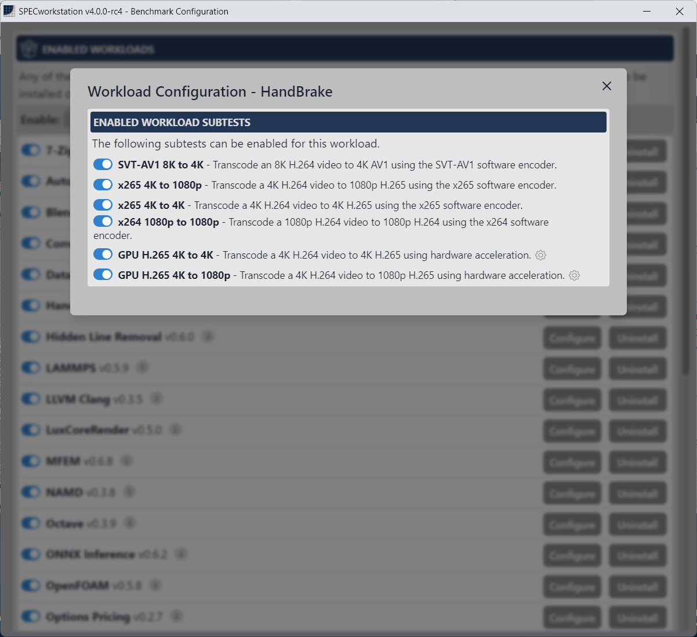

<!-- omit from toc -->
# User Guide for SPECworkstation® 4.0

    

<!-- omit from toc -->
## Table of Contents
<!-- TOC -->
- [Benchmark Overview](#benchmark-overview)
  - [Scoring](#scoring)
  - [Result Output](#result-output)
  - [Reference Machine](#reference-machine)
  - [Run Rules](#run-rules)
  - [Submission Candidate](#submission-candidate)
- [Setup](#setup)
  - [System Requirements](#system-requirements)
  - [Download](#download)
  - [Install](#install)
  - [Offline Install](#offline-install)
  - [Uninstall](#uninstall)
- [Benchmark Usage](#benchmark-usage)
  - [Main Window](#main-window)
  - [Benchmark Configuration](#benchmark-configuration)
  - [Run Benchmark](#run-benchmark)
  - [Run Status and Completion](#run-status-and-completion)
  - [Manage Results](#manage-results)
  - [Result Packaging and Submission](#result-packaging-and-submission)
  - [System Configuration](#system-configuration)
  - [Advanced Settings](#advanced-settings)
  - [Command-Line Interface](#command-line-interface)
- [Glossary](#glossary)
- [Known Issues](#known-issues)
  - [General Issues](#general-issues)
  - [Windows 10 Support](#windows-10-support)
  - [Workload Issues](#workload-issues)
- [FAQ](#faq)
- [Links](#links)
- [Copyright](#copyright)
<!-- /TOC -->

## Benchmark Overview
The SPECworkstation® benchmark is developed by the SPEC® Graphics & Workstation Performance Group's ([SPECgwpg](https://gwpg.spec.org/about-gwpg/)) Workstation Performance Characterization (SPECwpc®) subcommittee to test professional workstation use cases.  The benchmark contains 20+ distinct workloads with 80+ subtests and is intended to aide in purchasing and upgrade decisions for professional users in a variety of industries that rely on computer workstations. Composite scores are categorized and reported by industry vertical and hardware subsystem to allow users to focus on their intended use cases and to understand the performance impact of specific hardware components.  Users may compare their system performance to results posted by SPEC on the [official SPECworkstation results page](https://gwpg.spec.org/specworkstation-results/).

### Scoring
The benchmark reports three types of scores: category SPEC ratios, workload SPEC ratios, and subtest SPEC ratios. Category and workload SPEC ratios are composite scores calculated by taking a weighted geometric mean of the constituent subtest SPEC ratios (individual test weights are available in the CSV result output). Subtest SPEC ratios are calculated by normalizing the measured result of a subtest to a reference machine result, with the intention that the [reference machine](#reference-machine) achieves a SPEC ratio of approximately `1.0` for all categories, workloads, and subtests.

Category scores include all industry vertical and hardware subsystem scores. The benchmark reports the following category scores:

| Type | Category Score |
| --- | --- |
| Industry Vertical  | _AI & Machine Learning_ |
|                     | _Energy_ |
|                     | _Financial Services_ |
|                     | _Life Sciences_ |
|                     | _Media & Entertainment_ |
|                     | _Product Design_ |
|                     | _Productivity & Development_ |
| Hardware Subsystem | _Accelerator_ | 
|                     | _CPU_ |
|                     | _Graphics_ |
|                     | _Storage_ |

Category scores are derived directly from subtest SPEC ratios, and not from a composite of workload scores, i.e. category scores may contain some, but not all, subtests from a workload. For example the Product Design industry vertical SPEC ratio includes only select subtests from the Viewport Graphics and WPCstorage workloads.  A complete list of contributing subtests for each category and workload are shown in the generated results. Reference an official result for a full breakdown; results are available on the [official SPECworkstation results page](https://gwpg.spec.org/specworkstation-results/).

### Result Output

Each benchmark run and iteration produces a result folder with scores reported in HTML, CSV, and JSON formats.  The HTML result summary page shows select [system configuration](#system-configuration) information, [submission details](#manage-results) (if entered by the user), and all calculated composite category and workload SPEC ratios.  If any subtest of a category or workload did not produce a score, either because it was unselected or encountered errors, the composite score will be omitted from the results.

<!-- center image template -->

    
     
    <em>HTML results summary page</em>

Users may view more details for a category by selecting its page in the left navigation bar. Individual category pages list all contributing subtests. The `Workload Scores` page shows the full data for every workload and subtest that completed successfully.

<!-- center image template -->

    
     
    <em>HTML results vertical category page</em>

### Reference Machine
The following machine configuration is used to measure reference results.  Reference results are used to calculate subtest SPEC ratios, with the intention that the reference machine achieves a [SPEC ratio](#glossary) of approximately `1.0` for all categories, workloads, and subtests.

| Component | Specification |
| --- | --- |
| CPU | _i7-12700 (8C/16T+4E)_ |
| Graphics | _WX3200 4GB_ |
| RAM | _2x16GB DDR5 4400_ |
| Disk | _512GB NVMe M.2 SSD_ |
| OS | _Windows 11 Professional_ |

### Run Rules
For results to be considered official and submission candidates, the following rules must be followed:

1. The system under test must complete all the official workloads and subtests without errors or warnings. This condition is checked automatically by the benchmark and valid results are marked as submission candidates in the [result manager](#manage-results) and the HTML result file.
1. No benchmark files may be modified, including but not limited to, binaries, input data, and workload configurations.
1. The display and Windows Desktop used by the benchmark must have a resolution of 1920x1080 or higher.
1. Windows DPI scaling must be set to 100%.
1. During the Viewport Graphics workload, the benchmark window should be the topmost and not obscured by any other window or UI element except the [benchmark status window](#run-status-and-completion).
1. Optimizations for Viewport Graphics subtests used in this benchmark must adhere to the standards outlined in the [SPECviewperf® 2020 run rules](https://gwpg.spec.org/benchmarks/benchmark/specviewperf-2020-v3-1/#jet-tabs-control-5274) as applicable.
1. Interaction with the system under test during the benchmark is not allowed unless required by the benchmark. It is not permissible to interact with the system under test to influence the progress of the benchmark during execution.
1. It is not permissible to override the benchmark's intended behavior through any means, including but not limited to, registry settings or environment variables.
2. The benchmark must be run using its included graphical or [command-line interface](#command-line-interface), and [results packaged](#result-packaging-and-submission) using the [result manager](#manage-results) interface.
3. The benchmark must be run with Windows privileges and the appropriate firewall settings to allow it to be completed without interruption.

### Submission Candidate
A submission candidate is a result that may be submitted to SPEC for publication on the [official SPECworkstation results page](https://gwpg.spec.org/specworkstation-results/). The following are the criteria for a submission candidate to be published by SPEC:
1. *All* official workloads completed without errors or warnings.
2. The user followed the [run rules](#run-rules) when collecting results.
3. The machine model and configuration can be purchased by the general public at the time of submission.
4. Screen grabs from the Viewport Graphics workload match the [reference images](./Reference-Images).
5. The result is [packaged with complete submission details](#result-packaging-and-submission).

The results manager and the HTML result file will automatically verify and mark a result as a submission candidate if all workloads completed successfully, but the automatic verification cannot validate all the above criteria. If submitted to SPEC, a result will be reviewed manually for conformance to the submission criteria.

Information on where to submit results and the associated costs are detailed on the [SPECgwpg membership page](https://gwpg.spec.org/membership/).

## Setup

### System Requirements

The following is the minimum supported system configuration.  The benchmark may still run on systems that do not meet these requirements, but support will not be provided by SPEC for any such configuration.

| Component | Requirement |
| --- | --- |
| CPU | _8th Generation Core i5_ or _Ryzen 3000 series_ or newer |
| Graphics | _AMD_, _Intel_, or _NVIDIA_ GPU with _2GB or greater shared or dedicated memory_, _OpenGL 4.5_, _DirectX 12_, and _Hardware H.265_ encoding |
| RAM | _14GB available system RAM_ and _at least 1GB/thread_ |
| Disk | _100GB free space_ for install and execution |
| OS | _Windows 11 Professional_ |

### Download
Download the benchmark from the [SPECgwpg website](https://gwpg.spec.org/). The benchmark is free to download for everyone except sellers of computers and related products. A paid license is required for any for-profit entity that sells computers or computer related products in the commercial marketplace, with the exception of [SPECgwpg member companies](https://gwpg.spec.org/membership/).

### Install

The installer requires approximately 500MB of free space and will install the benchmark in the `Program Files\SPECworkstation 4` folder by default. After the benchmark is installed, the workload installation window will be shown to allow the user to select and install workloads.

<!-- center image template -->

    
     
    <em>Workload install window</em>

The benchmark requires at least one workload to be installed to run.  The workload installation interface allows users to select individual workloads, or to filter based on industry verticals or hardware subsystems.  Generating an official and submittable result requires all workloads to be installed.  Selected workloads will have their installation packages downloaded to the user's `Downloads` folder unless a different folder is specified. Workload installation packages will be deleted automatically after the workload is extracted and installed on the system.

### Offline Install

To create an offline install package, users must first install the benchmark on a system with an internet connection, unselect the `Delete Downloads After Extraction` option, and select all workloads to be included in the offline install. The downloaded workload packages should be placed in the same folder as the installer and may be copied to other machines for offline installation.

### Uninstall

Individual workloads may be uninstalled from the [benchmark configuration](#benchmark-configuration) window. The benchmark and all workloads may be uninstalled from the Windows "Add or remove programs" control panel interface.  Result folders will not be erased when uninstalling, but can be safely deleted manually (default location for results is `Documents\SPEC Results\SPECworkstation 4`).

## Benchmark Usage

### Main Window

<!-- center image template -->

    
     
    <em>SPECworkstation graphical user interface (GUI)</em>

The main GUI interface allows the user to configure and run the benchmark. An update check is performed at startup; if an update is available, a tooltip will be shown at the top of the window. The `Enabled Workloads` field shows how many workloads have been selected to run out of the total number of workloads available.  The numbers will be shown in red font if the run will not be considered a [submission candidate](#submission-candidate) or errors are detected with any subtest; opening the [benchmark configuration](#benchmark-configuration) window may provide additional details on workload errors.  Workload selection can be changed via the benchmark configuration menu opened with the gear icon next to `Run Benchmark`.

### Benchmark Configuration

The benchmark configuration window allows users to select which workloads and subtests to run. If a workload has the `Configure` option, it may have subtests that can be individually selected or configured. The `Enable` bar allows workload selection by commonly used presets or by category (subystems or verticals). Some workloads may not enable all configurations of a subtest in the `Default` selection. For example, the WPCstorage workload only configures its subtests to run on the drive on which the benchmark is installed by default. Choosing `All` will activate every configuration of all subtests, including multiple drives for WPCstorage. The benchmark configuration window will also present options to install/uninstall a workload, or update a workload if a new version is available. An internet connection is required to install or update a workload.

<!-- center image template -->

    
     
    <em>Benchmark configuration window for workload selection</em>

<!-- center image template -->

    
     
    <em>Workload configuration window for subtest selection</em>

### Run Benchmark

Selecting `Run Benchmark` from the main window will display a confirmation window showing the selected workloads and configuration details of the run.

<!-- center image template -->

    
     
    <em>Run benchmark confirmation window</em>

The confirmation window will state if the run can generate a [submission candidate](#submission-candidate) result for submission to SPEC to publish on the [official SPECworkstation results page](https://gwpg.spec.org/specworkstation-results/). Note, the benchmark does not automatically send or upload any information to SPEC.  Results or system configuration details are not uploaded or collected automatically -- they must be [packaged](#result-packaging-and-submission) and sent to SPEC by the user.

### Run Status and Completion

During a run, the benchmark status window will show which workload and subtest are currently executing and the overall progress of the benchmark run.

<!-- center image template -->

    
     
    <em>Benchmark status window</em>

After a run completes, the user is given the option to open the results manager.

<!-- center image template -->

    
     
    <em>Run complete window</em>

### Manage Results

The `Manage Results` button in the [main window](#main-window) or the `Open Results Manager` button in the [run completion window](#run-status-and-completion) opens the results manager. Clicking a result will open the HTML result file.

<!-- center image template -->

    
     
    <em>Manage results window</em>

The `results directory` link at the top of the results manager will open the currently set result folder. The default result folder is `Documents\SPEC Results\SPECworkstation 4`, but can be changed from the [advanced settings menu](#advanced-settings). Note that results may be marked `Candidate` or `Not A Candidate`. If the submission status is `Candidate`, the results may be [packaged and submitted](#result-packaging-and-submission) to SPEC for review and publication. If [submission details](#result-packaging-and-submission) are complete, the submission status will show `Ready To Submit`.

A result's directory may be accessed by clicking the folder icon next to a result. The result directory includes results in HTML, CSV, and JSON formats, along with logs, screen grabs, and other meta-data from each selected workload from the run.  If a result is expected to be submitted to SPEC for publication, all files in the result directory should remain unaltered.

Results may be annotated with a title and other submission information.  Clicking the pencil icon in the result row will open the results / submission details window.

<!-- center image template -->

    
     
    <em>Results / Submission details window</em>

Adding submission details is required only if submitting a result to SPEC. Users may also use this functionality to rename results and keep notes for their own tracking purposes.

### Result Packaging and Submission

The [Manage Results](#manage-results) window allows users to select results for packaging and/or submission.  Selecting one or more results with the checkbox will enable the `Package Selected Results` button, which generates a zip file containing the selected results. The result package will be created in the same folder as the results (default folder: `Documents\SPEC Results\SPECworkstation 4`).

<!-- center image template -->

    
     
    <em>Select results to package from the result manager window</em>

A user may package results for their own convenience or, if a result is marked as a `Candidate`, for submission to SPEC.  Submissions to SPEC must include complete submission details for every packaged result. Submission comments must include any performance-relevant system customization details that are not captured in the [system configuration](#system-configuration) window and may include any additional information helpful to the reviewer. Examples of additional information to include in the comments:
1. Links to GPU/accelerator driver download web pages
1. Any modified BIOS settings, e.g. disabling SMT or hyper-threading, overclocking, RAM speed/timings, etc.
1. Windows power profile selection and any changes to default profiles
1. Disabling VSYNC
1. Status of Windows Real-time protection and any virus scan exclusions
1. Links to system specification or purchase web pages

Before submitting, review the complete [submission candidate](#submission-candidate) criteria.

### System Configuration
System configuration details collected by the benchmark can be viewed by clicking the info icon in the top right of the [main window](#main-window).

<!-- center image template -->

    
     
    <em>Info icon to open system configuration window</em>

Options are provided to export details in various formats.  Note that the detected configuration details are embedded into all result files.  System details do not contain user-identifiable information and users can verify no personal details are exposed by inspecting the information in this screen. The `Exporting Debug Data` option may generate output containing identifiable information, but is typically only needed for debugging and support requests.

<!-- center image template -->

    
     
    <em>System configuration window</em>

### Advanced Settings
The advanced settings menu is located at the bottom of the [Benchmark Configuration](#benchmark-configuration) window. Each option is described in the table below.

<!-- center image template -->

    
     
    <em>Advanced settings menu</em>

| Option | Description |
| --- | --- |
| Results Directory | Change the default results directory where results are saved.  The result manager window will only show results from the directory listed in this field. If changed, the result directory can be reset to default by clicking the reset icon next to the input field. |
| Download Directory | Change the default directory where workload installation packages are downloaded and saved. |
| Delete Download After Extraction | If checked, automatically deletes workload installation packages after successful installation. Uncheck this if you plan to create an offline install bundle. |
| Enable Workload Timeout | If checked, tests will terminate after a pre-defined timeout and proceed to the next test. Disable this if your system is encountering frequent timeouts and you believe the workload is still running correctly. Default timeouts for most workloads are 2-3X the measured time to execute on the reference machine. |
| Workload Gap | Add a waiting period between workload execution. May be used to allow systems to thermally recover between workloads.  Note, setting a workload gap >0 will disqualify a result from becoming an official submission candidate for publication by SPEC. |

### Command-Line Interface

The command-line interface (CLI) enables easy automation and integration into scripts.  The CLI is invoked with the `SPECworkstation-CLI.exe` binary found in the install folder (default `Program Files\SPECworkstation 4`). Run the CLI without any options or with the help command, `SPECworkstation-CLI.exe --help`, to display all available options.

<!-- center image template -->

    
     
    <em>Command-line interface</em>

Some common CLI options are shown in the following table:

| CLI Option | Description |
| --- | --- |
| `--help` / `-h` | Display all options and parameters |
| `--list` / `-l` | List available workloads and subtests |
| `--official` / `-o` | Run all official workloads |
| `--run` / `-r` | Run all installed workloads |
| `--workload` / `-w` `[workload-list]` | Run selected workloads |

During a CLI run, the benchmark will accept the following commands to stop or skip workloads:

| Command | Description |
| --- | --- |
| `Ctrl+C` | Cancel benchmark run, attempt to save partial results |
| `x` | Abort and skip the currently running workload |

## Glossary
| Term | Definition |
| --- | --- |
| category | An _Industry Vertical_ or _Hardware Subsystem_, e.g. "CPU" or "Product Design" |
| reference machine | A machine configured to collect _reference results_ and generate _category_, _workload_, and _subtest_ _SPEC ratios_ of `1.0` |
| reference result | The performance measurement of a _subtest_ from the _reference machine_ |
| SPEC ratio | A SPEC-defined scoring unit that is either a composite of subtest _SPEC ratios_ or, in the case of _subtests_, a measured result normalized to a _reference result_. See [Scoring](#scoring) for more details. |
| vertical | Shortened form of _Industry Vertical_, a type of scoring category, e.g. "Product Design" |
| subsystem | Shortened form of _Hardware Subsystem_, a type of scoring category, e.g. "CPU" |
| workload | A collection of related _subtests_ that generate a _workload_ _SPEC ratio_ |
| subtest | A single  test that has a _reference result_ and generates a _SPEC ratio_ |

## Known Issues
Review the known issues and workarounds if you are encountering problems in running the benchmark or are generating unexpected results.

### General Issues
1. Using the [Command-Line Interface](#command-line-interface) in Windows 11 24H2 or newer may result in reduced performance or timeouts if the operating system relegates `SPECworkstation-CLI.exe` to a background task. Running via the [GUI](#main-window) and keeping the benchmark in focus is a workaround.
2. Systems may experience thermal saturation during a benchmark run, increasing variability and reducing performance. Improve system cooling or thermals, or workaround thermal limits by increasing the workload gap in [Advanced Settings](#advanced-settings). Note changing the workload gap will disqualify a result from being a [submission candidate](#submission-candidate) for publication by SPEC.
3. Virus scanners and Windows Real-time protection may severely affect the performance of some workloads that read or write many files. 7-zip and OpenFOAM are known to be affected.
4. Workloads using Python, such as Data Science and Python 3 may timeout.  This may be caused by an outdated Microsoft C++ Redistributable installation.  Update your system with an install package from [Microsoft's C++ Redistributable download page](https://learn.microsoft.com/en-us/cpp/windows/latest-supported-vc-redist). Workload performance is not impacted since the issue occurs outside the timed sections.
5. Results folder may contain `queryLog` folders that were not deleted automatically.  These may be deleted safely if not being used for debugging a benchmark initialization failure.
6. Calculated [SPEC ratio](#glossary) values may differ slightly between the JSON and the CSV/HTML result files due to differences in precision and rounding. Official scores should be reported from the CSV or HTML result files.
7. Some machine configurations (typically machines with specifications below the [system requirements](#system-requirements)) may timeout while running workloads.  Timeouts may be disabled in the [Advanced Settings](#advanced-settings) menu or via a [CLI option](#command-line-interface). Results may still be considered [submission candidates](#submission-candidate) if timeouts are disabled.

### Windows 10 Support
Windows 10 may run but is not officially supported. The following issues and workarounds are known on Windows 10:

1. Users may encounter failures in various workloads including Compilation, Python, and Data Science due to long paths not being enabled by default. Resolution is to enable long paths.
2. MPI workloads may not utilize all threads; affects MPI workloads including MFEM, NAMD, and LAMMPS.  No known workaround, caused by limited support for high core count or heterogeneous core configurations on Windows 10.
3. High core-count (i.e. >32 cores) or heterogenous core configuration (e.g. performance/efficiency or classic/dense) systems may encounter low performance. No known workaround, caused by limited support for high core count or heterogeneous core configurations on Windows 10.

### Workload Issues

<!-- omit from toc -->
#### 7-zip
1. Performance may be severely affected by virus scanners and/or Windows Real-time protection.
1. 7-zip may ignore the [advanced setting](#advanced-settings) to disable workload timeouts.
1. 7-zip subtest [reference results](#glossary) may be lower/slower than expected; a user testing the [reference machine](#reference-machine) configuration may measure a [SPEC ratio](#glossary) consistently higher than `1.0` for this workload. This does not affect test accuracy or comparability of the score to other machine configurations since the reference result is only used as a common denominator for SPEC ratio calculations.
2. If the test runs out of disk space while executing, the output log in the [benchmark status window](#run-status-and-completion) may incorrectly show the test as aborted by the user.  Ensure there is sufficient space on your disk to run the benchmark.

<!-- omit from toc -->
#### Blender
1. Warnings in output logs - object name/ID found more than once.

<!-- omit from toc -->
#### Data Science
1. May be affected by the Python timeout issue mentioned in [General Issues](#general-issues).
2. Warnings in output logs - deprecation of packages and `numpy.ndarray` warnings.

<!-- omit from toc -->
#### Handbrake
1. HTML and CSV result output does not show when Handbrake GPU subtests fail result validation; however, an error is shown at run completion and a warning is added to the `results.json`. Note the HTML result output may be marked as a [submission candidate](#submission-candidate), but the result will not be accepted for publication by SPEC if any errors or warnings are present in the `results.json`. Users can verify if their result is free of errors and warnings by reviewing the `results.json` output file and searching for the existence of `"errors"` or `"warnings"` fields. Users should not compare the performance of valid results to results with any errors or warnings.
1. The Handbrake workload requires the GPU device name string to contain `AMD`, `Intel` or `NVIDIA`. Pre-production parts missing the vendor name in the string will not be detected properly and will be unable to run the workload.

<!-- omit from toc -->
#### NAMD
1. Warnings in output logs - molecular interaction and molecular bond warnings.

<!-- omit from toc -->
#### Octave
1. Warnings in output logs - `Invalid UTF-8 byte sequences have been replaced`.

<!-- omit from toc -->
#### OpenFOAM
1. Performance may be severely affected by virus scanners and/or Windows Real-time protection.

<!-- omit from toc -->
#### Python 3
1. May be affected by the Python timeout issue mentioned in [General Issues](#general-issues).

<!-- omit from toc -->
#### Viewport Graphics
1. Viewport Graphics CATIA subtest may show visual differences between NVIDIA workstation and consumer drivers. [Reference images](./Reference-Images) for submission candidates are collected from workstation drivers and only visually matching results will be valid for submission and publication by SPEC. Users should not directly compare workstation and consumer driver performance for this subtest due to the visual discrepancy.
1. Out of date drivers may result in failures or incorrect output. Ensure your drivers are up to date to avoid issues.
1. Various warnings and benign errors are present in the output logs.

<!-- omit from toc -->
#### WPCstorage
1. Removable drives are typically excluded from the test list; however some removable drives present themselves as permanent storage in the OS. The benchmark will only detect available drives at launch, so connecting or disconnecting removable drives while the benchmark is open/running may result in failures if removable drives were disconnected and selected for testing.
2. WPCstorage may list CD-ROM drives as a target disk but will mark them as unselectable due to a disk space error. This does not affect results or [submission candidate](#submission-candidate) criteria.
3. Temporary files may remain on the system after a failed or aborted run, even after uninstalling the workload or the benchmark. This workload writes files to the root directory of each tested storage device and cleanup is done before and after each benchmark run; if the test fails or is aborted, the cleanup step may not occur. The temporary files can be safely deleted except while the benchmark is running.

## FAQ

**What is SPECworkstation?**

_The SPECworkstation benchmark is a performance evaluation tool created to test professional workstation use cases. Refer to the [Benchmark Overview](#benchmark-overview) section for more information._

---

**Who develops SPECworkstation?**

_The SPECworkstation benchmark is developed by the [SPEC](https://www.spec.org/) Graphics & Workstation Performance Group ([SPECgwpg](https://gwpg.spec.org/)), specifically its SPEC Workstation Performance Characterization (SPECwpc) subcommittee._

---
**How many workloads and tests are included?**

_SPECworkstation 4.0 includes 23 workloads with over 80 subtests. Inspect an [official result](https://gwpg.spec.org/specworkstation-results/) for a full list of categories, workloads, and subtests in the benchmark._

---

**What industry use cases are covered by the benchmark?**

_A list of industry vertical scores is provided in the [Scoring](#scoring) section._

---

**What types of hardware is tested?**

_The benchmark is designed to be a full system test, but also approximates contributions from specific hardware components. A list of hardware subsystem scores measured is provided in the [Scoring](#scoring) section._

---

**How do I download the benchmark?**

_Download it from the SPECgwpg website, [gwpg.spec.org](https://gwpg.spec.org/). It is provided free for everyone except sellers of computers and related products._

---

**How do I create an offline installation package?**

_Refer to [Offline Install](#offline-install) for instructions to create an offline installer._

---

**Where is the benchmark installed?**

_It is installed in `Program Files\SPECworkstation 4` by default. Users may change the default install folder during setup._

---

**What are the minimum system requirements to install and run the benchmark?**

_Refer to [System Requirements](#system-requirements) for the minimum supported system configuration._

---

**Can I install or run with only a specific set of workloads?**

_Yes, you can install a subset of workloads during the [install](#install) step. Each benchmark run can be [configured](#benchmark-configuration) to run a subset of installed workloads and subtests._

---

**Can I configure the number of benchmark iterations?**

_Yes, the number of iterations can be configured in the [main window](#main-window). Note that each iteration will generate a separate result folder.  Results from multiple iterations are not automatically combined or averaged._

---

**How can I automate or script benchmark runs?**

_Refer to the [Command-Line Interface](#command-line-interface) section for details on how to access and run from a console or scripts. The CSV output may also be used for automated result parsing._

---

**Can I disable certain subtests of a workload?**

_Yes, the [benchmark configuration window](#benchmark-configuration) allows you to enable or disable subtests for most workloads. Subtest selection will be disabled for workloads that have subtests that must be run together._

---

**How are the benchmark results scored?**

_Refer to the [Scoring](#scoring) sections for details on results and scores._

---

**Where are the benchmark results stored?**

_The default result folder is `Documents\SPEC Results\SPECworkstation 4`; however the user may change the folder in the [advanced settings](#advanced-settings) menu._

---

**How are results output and formatted?**

_Results are output in JSON, CSV, and HTML formats for every run._

---

**How can I view the benchmark results?**

_Results may be viewed from the [Manage Results](#manage-results) window in the GUI or by navigating directly to the default result folder: `Documents\SPEC Results\SPECworkstation 4`._

---

**How do I ensure my benchmark run qualifies for submission and publication by SPEC?**

_Refer to the [Submission Candidate](#submission-candidate) section for submission criteria._

---
**What happens if my submission is disqualified?**

_Submissions not meeting the [submission criteria](#submission-candidate) may be disqualified and returned to the submitter with comments or suggestions.  Note that submission fees are only collected for published results, so a disqualified submission will not incur any costs._

---

**How do I package my results for submission?**

_Refer to the [Result Packaging and Submission](#result-packaging-and-submission) section for details on how to prepare a package for submission._

---

**How do I use the Command-Line interface (CLI)?**

_Refer to the [Command-line interface](#command-line-interface) section for how to invoke the command-line interface and display useful parameters and options._

---

**Can I run individual workloads using CLI?**

_Yes, the CLI can launch individual workloads or subtests. Refer to the [Command-line interface](#command-line-interface) section for more details._

---

**What is the workload gap setting?**

_A workload gap sets a delay between workload executions. Refer to the [Advanced Settings](#advanced-settings) section for more details about this option._

---

**What are the known issues or bugs?**

_Refer to the [Known Issues](#known-issues) section to find a list of known problems and some workarounds._

---

**What caused the Handbrake GPU subtests to fail?**

_The Handbrake GPU tests require an AMD, Intel, or NVIDIA GPU with H.265 hardware encoding support.  Refer to the [Handbrake known issues](#handbrake) for more details on the limitations of this workload._

---

**What should I do if the benchmark triggers a virus scan?**

_Windows Real-time protection or other virus scans may impact performance if they trigger during a benchmark run. Users may temporarily disable virus scanners or setup virus scanner exclusions at their own risk._

---

**What is a "Candidate" result?**

_Refer to the [Submission Candidate](#submission-candidate) section for more information._

---

**Is it possible to uninstall workloads but keep the results?**

_Yes, uninstalling individual workloads or the entire benchmark does not delete any results._

---

**What should I do if some workloads fail during the benchmark run?**

_Ensure your machine meets the [system requirements](#system-requirements). Refer to the [Known Issues](#known-issues) section to see if your problem is documented and has a workaround. Check the HTML results for information on the errors. Check the output and error logs inside the results directory. If the error persists, consider submitting a bug report with your result folder and any relevant logs/details on the [SPECgwpg support page](https://gwpg.spec.org/support/)._

---

**How do I report issues or get help?**

_See if your question or issue is answered by this user guide or documented in the [Known Issues](#known-issues) section.  If you need further assistance reach out to us via the [SPECgwpg support page](https://gwpg.spec.org/support/)._

---
## Links
1. [Standard Performance Evaluation Corporation (SPEC)](https://www.spec.org/)
1. [SPEC Graphics & Workstation Performance Group (SPECgwpg)](https://gwpg.spec.org/)
1. [Official SPECworkstation Results](https://gwpg.spec.org/specworkstation-results/)

## Copyright
© 2024 Standard Performance Evaluation Corporation