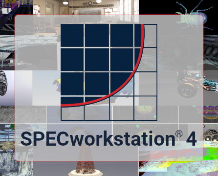

<!-- omit from toc -->
# Workload Documentation for SPECworkstation® 4.0

    

<!-- omit from toc -->
## Table of Contents
- [1 Categories](#1-categories)
- [2 Workload Descriptions](#2-workload-descriptions)
  - [2.1 7-Zip](#21-7-zip)
  - [2.2 Autodesk Inventor](#22-autodesk-inventor)
  - [2.3 Blender](#23-blender)
  - [2.4 Convolution](#24-convolution)
  - [2.5 Data Science](#25-data-science)
  - [2.6 HandBrake](#26-handbrake)
  - [2.7 Hidden Line Removal](#27-hidden-line-removal)
  - [2.8 LAMMPS](#28-lammps)
  - [2.9 LLVM Clang](#29-llvm-clang)
  - [2.10 LuxCoreRender](#210-luxcorerender)
  - [2.11 MFEM](#211-mfem)
  - [2.12 NAMD](#212-namd)
  - [2.13 Octave](#213-octave)
  - [2.14 ONNX Inference](#214-onnx-inference)
  - [2.15 OpenFOAM](#215-openfoam)
  - [2.16 Options Pricing](#216-options-pricing)
  - [2.17 Poisson](#217-poisson)
  - [2.18 Python 3](#218-python-3)
  - [2.19 Rodinia CFD](#219-rodinia-cfd)
  - [2.20 Rodinia Life Sciences](#220-rodinia-life-sciences)
  - [2.21 SRMP](#221-srmp)
  - [2.22 Viewport Graphics](#222-viewport-graphics)
  - [2.23 WPCstorage](#223-wpcstorage)

## 1 Categories

There are two types of scoring categories in the SPECworkstation® benchmark, _industry verticals_ and _hardware subsystems_. Subtests are individually scored commands  assigned to an _industry vertical_ and a _hardware subsystem_. Subtests in an industry vertical are related by use-case or application to a similar market or industry, and subtests assigned to the same hardware subsystem primarily exercise a specific hardware component.

Workloads are a collection of subtests that use the same or related software packages, but subtests from a single workload may be assigned to different categories depending on their use-case and targeted hardware.

 The benchmark reports scores for the following industry verticals and hardware subsystems:

| Type | Category Score |
| --- | --- |
| Industry Vertical  | _AI & Machine Learning_ |
|                    | _Energy_ |
|                    | _Financial Services_ |
|                    | _Life Sciences_ |
|                    | _Media & Entertainment_ |
|                    | _Product Design_ |
|                    | _Productivity & Development_ |
| Hardware Subsystem | _Accelerator_ | 
|                    | _CPU_ |
|                    | _Graphics_ |
|                    | _Storage_ |

Reference the [workload descriptions](#2-workload-descriptions) section to determine a subtest's assigned categories, or reference an official result for a listing by category; results are available on the [official SPECworkstation results page](https://gwpg.spec.org/specworkstation-results/).

## 2 Workload Descriptions

This section contains workload and subtest descriptions. Each subtest is labeled with its [categories](#1-categories) (_industry vertical_ and _hardware subsystem_) and workloads are labeled with a _computing style_ that represents how the workload is launched and executed in SPECworkstation.  The _computing style_ may vary from other uses or implementations of the underlying application. 

| Computing&nbsp;Style | Description |
| --- | --- |
| Lightly&#x2011;threaded | The tested application creates a single process and launches one or a limited number of threads.  Performance may scale with CPU frequency and is not expected to scale with a higher number of CPU cores. |
| Multi&#x2011;threaded | The tested application creates a single process and launches multiple threads. The number of threads launched will usually be equal to the number of CPU cores or hardware threads available.  Performance will typically scale with a higher number of CPU cores.
| Multiple&nbsp;Processes | The tested application launches multiple processes and may use the message passing interface (MPI) standard to coordinate execution.  Performance will typically scale with a higher number of CPU cores.
| Accelerator | The tested application executes on specialized hardware. Performance will primarily scale with the specialized hardware used.
| Graphics | The tested application executes a graphics engine.  Performance will primarily scale with the graphics hardware in the system.
| Storage | The tested application measures storage hardware performance.  Performance will primarily scale with disk and storage device performance in the system.

### 2.1 7-Zip

The [7-Zip](https://www.7-zip.org/) workload tests the popular open-source file archiver developed by Igor Pavlov, recognized for its high compression efficiency and versatility across various file formats.

> **Workload Description:** Test compression and decompression performance using 7-Zip, a popular file archive utility.

**[Computing Style](#computing-style):** Lightly-threaded.

**Subtests:**

1. **Decompression** | _Categories:_ Productivity & Development, CPU
   > **Summary:** Extract files from a 7z archive into a temporary folder.

   Extract a ~500MB 7z archive containing a project's source files compressed with LZMA.
   
2. **Compression** | _Categories:_ Productivity & Development, CPU
   > **Summary:** Compress files into a new 7z archive.
  
   Compress the files in the archive from the decompression subtest back into a 7z archive using 7-zip's default settings.

### 2.2 Autodesk Inventor

This workload executes tasks typically performed in [Autodesk Inventor](https://autodesk.com/inventor), one of the leading software solutions in the architecture, engineering, and construction (AEC) sector. This workload was contributed to SPEC by Autodesk. 

> **Workload Description:** Perform common operations in Autodesk Inventor, a professional software package used for product design and architecture, engineering, and construction (AEC).

**[Computing Style](#computing-style):** Lightly-threaded.

**Subtests:**

1. **Open Document** | _Categories:_ Product Design, CPU
   > **Summary:** Open an existing design document.

2. **Create/Update Files** | _Categories:_ Product Design, CPU
   > **Summary:** Create a new design document and update existing design files.

3. **Rebuild** | _Categories:_ Product Design, CPU
   > **Summary:** Rebuild design files.

   Measure the performance of rebuilding Autodesk Inventor design files, a common operation in iterative design and engineering flows.

4. **Render Style/Material** | _Categories:_ Product Design, CPU
   > **Summary:** Render design files using various materials.

   Apply different rendering materials to Autodesk Inventor design files to visualize the final product in different styles and materials.

### 2.3 Blender

The [Blender](https://www.blender.org/) workload evaluates CPU performance with open-source software widely used by animators, visual effects artists, and game developers to create movies, video games, and other 3D content. Blender is able to leverage high core-count CPUs, large amounts of memory, and powerful GPUs (although this workload focuses on CPU performance).

> **Workload Description:** Render 3D scenes with Blender using the Cycles path tracing engine on CPU.

**[Computing Style](#computing-style):** Multi-Threaded.

**Subtests:**

1. **Classroom** | _Categories:_ Media & Entertainment, CPU
   > **Summary:** Render a school classroom using the Classroom model by Christophe Seux.

2. **BMW27** | _Categories:_ Media & Entertainment, CPU
   > **Summary:** Render car models with the BMW27 model by Mike Pan. 

3. **BMW1M** | _Categories:_ Media & Entertainment, CPU
   > **Summary:** Render car models with the BMW1M model by Mike Pan.

4. **Island** | _Categories:_ Media & Entertainment, CPU
   > **Summary:** Render an island nature scene with the Island model by Agustin Benavidez.

### 2.4 Convolution

This workload measures the performance of applying a convolution filter to an image, a critical operation in signal processing and image analysis where it is essential for tasks like edge detection, sharpening, and feature extraction.

> **Workload Description:** Perform a multithreaded convolution filter pass on an image buffer.

**[Computing Style](#computing-style):** Multi-Threaded.

**Subtests:**

1. **20K/100** | _Categories:_ Energy, CPU
   > **Summary:** Apply a 100x100 convolution filter to a 20,000 x 20,000 image buffer.

### 2.5 Data Science

This workload is designed for data scientists to evaluate the efficiency and capability of their workstations in handling various data processing tasks. It involves running a series of synthetic benchmarks that simulate real-world AI and ML workflows using the Python-based data science libraries Pandas, Scikit-learn, and XGBoost.

> **Workload Description:** Evaluate data science and classical machine learning workflows using popular Python libraries.

**[Computing Style](#computing-style):** Multi-Threaded.

**Subtests:**

1. **Pandas** | _Categories:_ AI & Machine Learning, CPU
   > **Summary:** Process synthetic data based on the New York City Taxi dataset using Pandas and a random forest classifier algorithm.

2. **Scikit-learn** | _Categories:_ AI & Machine Learning, CPU
   > **Summary:** Process synthetic data based on a U.S. Census Bureau dataset, using Scikit-learn and a Ridge regression and classification algorithm.

3. **XGBoost** | _Categories:_ AI & Machine Learning, CPU
   > **Summary:** Process synthetic data based on the PLAsTiCC dataset using XGBoost.

### 2.6 HandBrake

The [HandBrake](https://handbrake.fr/) workload tests the transcoding performance of CPU-based software encoders and hardware accelerated encoders from AMD, Intel, and NVIDIA. The hardware accelerator tests validate the output with a peak signal-to-noise ratio (PSNR) threshold, ensuring output quality is comparable between vendor implementations.

> **Workload Description:** Transcode videos between popular formats and resolutions with Handbrake using software and fixed-function hardware encoders.

**[Computing Style](#computing-style):** Multi-threaded, Accelerator.

**Subtests:**

1. **SVT-AV1 8K to 4K** | _Categories:_ Media & Entertainment, CPU
   > **Summary:** Transcode an 8K H.264 video to 4K AV1 using the SVT-AV1 software encoder.

2. **x265 4K to 1080p** | _Categories:_ Media & Entertainment, CPU
   > **Summary:** Transcode a 4K H.264 video to 1080p H.265 using the x265 software encoder.

3. **x265 4K to 4K** | _Categories:_ Media & Entertainment, CPU
   > **Summary:** Transcode a 4K H.264 video to 4K H.265 using the x265 software encoder.

4. **x264 1080p to 1080p** | _Categories:_ Media & Entertainment, CPU
   > **Summary:** Transcode a 1080p H.264 video to 1080p H.264 using the x264 software encoder.

5. **GPU H.265 4K to 4K** | _Categories:_ Media & Entertainment, Accelerator
   > **Summary:** Transcode a 4K H.264 video to 4K H.265 using hardware acceleration.

6. **GPU H.265 4K to 1080p** | _Categories:_ Media & Entertainment, Accelerator
   > **Summary:** Transcode a 4K H.264 video to 1080p H.265 using hardware acceleration.

### 2.7 Hidden Line Removal

Hidden line removal is critical in rendering pipelines, where determining which lines of a 3D model are visible is essential for accurate image generation.

> **Workload Description:** Measure performance of vector and geometry construction by removing hidden lines from 2D renderings of 3D models.

**[Computing Style](#computing-style):** Multi-threaded.

**Subtests:**

1. **Palatov** | _Categories:_ Product Design, CPU
   > **Summary:** Perform hidden line removal on a 5 million polygon Palatov D2 car model provided by Palatov Motorsport.

### 2.8 LAMMPS

[LAMMPS](https://www.lammps.org/) (Large-scale Atomic/Molecular Massively Parallel Simulator) is a highly scalable molecular dynamics code designed for modeling particles in materials science, physics, and engineering. LAMMPS utilizes MPI to scale to multiple cores to perform complex simulations.

> **Workload Description:** Simulate molecular dynamics with LAMMPS, a freely available and scalable simulation software parallelized using MPI.

**[Computing Style](#computing-style):** Multiple Processes.

**Subtests:**

1. **LJ** | _Categories:_ Life Sciences, CPU
   > **Summary:** Simulate an atomic fluid with Lennard-Jones interactions.

2. **CHAIN** | _Categories:_ Life Sciences, CPU
   > **Summary:** Model the behavior of polymer chains.

3. **EAM** | _Categories:_ Life Sciences, CPU
   > **Summary:** Simulate a metallic solid using the embedded atom method (EAM).

4. **CHUTE** | _Categories:_ Life Sciences, CPU
   > **Summary:** Simulate particle interactions in granular chute flow.

5. **RHODO** | _Categories:_ Life Sciences, CPU
   > **Summary:** Simulate the rhodopsin protein in a solvated lipid bilayer.

### 2.9 LLVM Clang

LLVM Clang measures the performance of building the PyTorch deep learning framework from source code using a CMake, ninja, LLVM, and Clang compiler toolchain. This process involves compiling, linking, and creating an executable.

> **Workload Description:** Test code compilation performance using the LLVM compiler and toolchain.

**[Computing Style](#computing-style):** Multiple Processes.

**Subtests:**

1. **PyTorch** | _Categories:_ Productivity & Development, CPU
   > **Summary:** Build PyTorch from source using CMake, Ninja, and Clang.

### 2.10 LuxCoreRender

[LuxCoreRender](https://luxcorerender.org/) is a physically based, open-source rendering engine that generates highly realistic images by accurately simulating light behavior. This workload includes several tests that focus on different aspects of rendering, including direct light sampling and procedural generation.

> **Workload Description:** Render scenes with LuxCoreRender, a physically-based, open-source rendering engine.

**[Computing Style](#computing-style):** Multi-threaded.

**Subtests:**

1. **DLSC** | _Categories:_ Media & Entertainment, CPU
   > **Summary:** Render a scene with direct light sampling cache (DLSC).

1. **Food** | _Categories:_ Media & Entertainment, CPU
   > **Summary:** Render a scene with food with advanced lighting and materials.

1. **Danish Mood** | _Categories:_ Media & Entertainment, CPU
   > **Summary:** Render an indoor space with natural and artificial light sources.

1. **Procedural Leaves** | _Categories:_ Media & Entertainment, CPU
   > **Summary:** Render a scene with procedurally generated foliage.

### 2.11 MFEM

[MFEM](https://mfem.org/) is a high-performance library for scalable finite element analysis used in engineering and scientific simulations.

> **Workload Description:** Test MFEM, a high-performance library for solving scalable finite element discretization problems and parallelized with MPI.

**[Computing Style](#computing-style):** Multiple Processes.

**Subtests:**

1. **Dynamic AMR** | _Categories:_ Product Design, CPU
   > **Summary:** Perform dynamic adaptive mesh refinement (AMR) by iteratively refining, de-refining, and load balancing.

### 2.12 NAMD

[NAMD](https://www.ks.uiuc.edu/Research/namd/) is a high-performance molecular dynamics simulator used to model and analyze the behavior of biomolecular systems and is used for research in biochemistry, pharmacology, and molecular biology.

> **Workload Description:** Model large biomolecular systems with NAMD, a scalable molecular dynamics package designed for biological sciences.

**[Computing Style](#computing-style):** Multiple Processes.

**Subtests:**

1. **apoa1** | _Categories:_ Life Sciences, CPU
   > **Summary:** Simulate the dynamics of the apolipoprotein A1 molecule.

2. **f1atpase** | _Categories:_ Life Sciences, CPU
   > **Summary:** Simulate the molecular interactions of the F1-ATPase enzyme.

3. **stmv** | _Categories:_ Life Sciences, CPU
   > **Summary:** Simulate the molecular dynamics of the satellite tobacco mosaic virus (STMV).

### 2.13 Octave

[GNU Octave](https://octave.org/) is a freely available high-level programming language and interpreter with mathematics-oriented syntax largely compatible with MATLAB. This workload tests the Octave interpreter running common math operations.

> **Workload Description:** Evaluate the performance of common operations in Octave, an open-source scientific programming language with syntax compatible with MATLAB.

**[Computing Style](#computing-style):** Lightly-threaded.

**Subtests:**

1. **obench** | _Categories:_ Productivity & Development, CPU
   > **Summary:** Test basic functionality including loops, function integration, FFT, and matrix operations.

2. **benchmark2** | _Categories:_ Productivity & Development, CPU
   > **Summary:** Test data and math operations including matrix decomposition, sorting, linear regression and Fibonacci sequences.

### 2.14 ONNX Inference

[ONNX Runtime](https://onnxruntime.ai/) is a cross-platform and device-agnostic AI execution engine for training and inference.  The ONNX Inference workload tests inference latency and throughput using MLAS (Microsoft Linear Algebra Subprograms) on CPU and GPU-based execution via DirectML (DML).

> **Workload Description:** Measure inference latency and throughput on CPU and DirectML-capable GPUs using ONNX Runtime, a cross-platform machine-learning execution engine.

**[Computing Style](#computing-style):** Lightly-threaded, Multi-threaded, Accelerator.

**Subtests:**

1. **CPU ResNet50-FP32-batch8 Latency** | _Categories:_ AI & Machine Learning, CPU
   > **Summary:** Test CPU latency with the Resnet50 FP32 model.

2. **CPU ResNet50-FP32-batch8 Throughput** | _Categories:_ AI & Machine Learning, CPU
   > **Summary:** Test CPU throughput with the Resnet50 FP32 model.

3. **CPU ResNet50-INT8-batch8 Latency** | _Categories:_ AI & Machine Learning, CPU
   > **Summary:** Test CPU latency with the ResNet50 Int8 model.

4. **CPU ResNet50-INT8-batch8 Throughput** | _Categories:_ AI & Machine Learning, CPU
   > **Summary:** Test CPU throughput with the Resnet50 Int8 model.

5. **CPU SuperResolution-FP32-batch8 Latency** | _Categories:_ AI & Machine Learning, CPU
   > **Summary:** Test CPU latency with the Super Resolution FP32 model.

6. **CPU SuperResolution-FP32-batch8 Throughput** | _Categories:_ AI & Machine Learning, CPU
   > **Summary:** Test CPU throughput with the Super Resolution FP32 model.

7. **CPU SuperResolution-INT8-batch8 Latency** | _Categories:_ AI & Machine Learning, CPU
   > **Summary:** Test CPU latency with the Super Resolution Int8 model.

8. **CPU SuperResolution-INT8-batch8 Throughput** | _Categories:_ AI & Machine Learning, CPU
   > **Summary:** Test CPU throughput with the Super Resolution Int8 model.

9. **GPU ResNet50-FP32-batch32 Throughput** | _Categories:_ AI & Machine Learning, Accelerator
   > **Summary:** Test GPU throughput with the Resnet50 FP32 model.

1. **GPU ResNet50-INT8-batch32 Throughput** | _Categories:_ AI & Machine Learning, Accelerator
   > **Summary:** Test GPU throughput with the ResNet50 Int8 model.

1. **GPU SuperResolution-FP32-batch32 Throughput** | _Categories:_ AI & Machine Learning, Accelerator
   > **Summary:** Test GPU throughput with the Super Resolution FP32 model.

1. **GPU SuperResolution-INT8-batch32 Throughput** | _Categories:_ AI & Machine Learning, Accelerator
   > **Summary:** Test GPU throughput with the Super Resolution Int8 model.

### 2.15 OpenFOAM

[OpenFOAM](https://www.openfoam.com/) is a free open-source computational fluid dynamics (CFD) package. This workload utilizes the XiFOAM solver, a part of the OpenFOAM suite, to perform 2D Reynolds Averaged Simulation (RAS) for fluid dynamics analysis commonly used in fields like aerodynamics, automotive design, and industrial process modeling.

> **Workload Description:** Measure computational fluid dynamics (CFD) performance using the open-source OpenFOAM package.

**[Computing Style](#computing-style):** Multi-threaded.

**Subtests:**

1. **XiFoam Solver** | _Categories:_ Product Design, CPU
   > **Summary:** Model turbulent flows using a XiFOAM solver in a 2D Reynolds averaged simulation (RAS).

### 2.16 Options Pricing

The Options Pricing workload evaluates CPU performance in executing commonly used  options pricing models. These algorithms are fundamental in the financial industry for assessing the value of options and managing risk.

> **Workload Description:** Test options pricing models for financial services.

**[Computing Style](#computing-style):** Multi-threaded.

**Subtests:**

1. **Monte Carlo** | _Categories:_ Financial Services, CPU
   > **Summary:** Run a Monte Carlo simulation for option pricing using random sampling.

2. **Black-Scholes** | _Categories:_ Financial Services, CPU
   > **Summary:** Evaluate the Black-Scholes model for option pricing using differential equations.

3. **Binomial** | _Categories:_ Financial Services, CPU
   > **Summary:** Test a Binomial model for option pricing using an iterative process that generates a binomial tree.

### 2.17 Poisson

The Poisson workload solves a 2D Poisson equation, a fundamental partial differential equation used to simulate physical phenomena, such as electrostatics, heat conduction, and fluid flow.

> **Workload Description:** Evaluate a 2D discretized Poisson equation.

**[Computing Style](#computing-style):** Multi-threaded.

**Subtests:**

1. **Jacobi Rectangular Grid** | _Categories:_ Energy, CPU
   > **Summary:** Calculate a Jacobi iterative solution for a rectangular grid.

2. **Jacobi Square Grid** | _Categories:_ Energy, CPU
   > **Summary:** Calculate a Jacobi iterative solution for a square grid.

### 2.18 Python 3

The [Python 3](https://www.python.org/) workload evaluates CPU performance while executing fundamental matrix arithmetic operations using the [NumPy](https://numpy.org/) library.

> **Workload Description:** Test the performance of Python executing matrix operations using NumPy.

**[Computing Style](#computing-style):** Lightly-threaded.

**Subtests:**

1. **NumPy Create Matrix** | _Categories:_ Productivity & Development, CPU
   > **Summary:** Test initialization speed by creating zeroed matrices.

2. **NumPy Add Matrix** | _Categories:_ Productivity & Development, CPU
   > **Summary:** Perform matrix addition.

3. **NumPy Multiply Matrix** | _Categories:_ Productivity & Development, CPU
   > **Summary:** Perform matrix multiplication.

4. **NumPy Invert Matrix** | _Categories:_ Productivity & Development, CPU
   > **Summary:** Perform matrix inversion.

5. **NumPy Sin Matrix** | _Categories:_ Productivity & Development, CPU
   > **Summary:** Take the sin of a matrix.

6. **Multi-Matrix** | _Categories:_ Productivity & Development, CPU
   > **Summary:** Multiply several large matrices with CPU multithreading.

### 2.19 Rodinia CFD

The Rodinia CFD workload tests computational fluid dynamics (CFD) performance using tests from the [Rodinia](https://rodinia.cs.virginia.edu/) benchmark suite.

> **Workload Description:** Measure computational fluid dynamics (CFD) performance using the Rodinia CFD solver.

**[Computing Style](#computing-style):** Multi-threaded.

**Subtests:**

1. **Pre-Euler** | _Categories:_ Product Design, CPU
   > **Summary:** Execute an unstructured grid finite volume CFD solver for 3D Euler equations for compressible flow.

### 2.20 Rodinia Life Sciences

The Rodinia Life Sciences workload tests algorithms commonly used in life sciences, including bioinformatics and computational biology applications. This workload executes tests from the [Rodinia](https://rodinia.cs.virginia.edu/) benchmark suite to simulate complex tasks such as molecular dynamics, medical imaging, and thermal simulations.

> **Workload Description:** Test a collection of algorithms from the Rodinia benchmark suite that target use-cases in physical simulation, medical imaging and molecular dynamics.

**[Computing Style](#computing-style):** Multi-threaded.

**Subtests:**

1. **Heart Wall** | _Categories:_ Life Sciences, CPU
   > **Summary:** Track the motion of a heart wall in a sequence of ultrasound images.

2. **HotSpot** | _Categories:_ Life Sciences, CPU
   > **Summary:** Perform an iterative thermal diffusion simulation by solving a series of differential equations.

3. **LavaMD** | _Categories:_ Life Sciences, CPU
   > **Summary:** Calculate N-body molecular interactions in parallel by subdividing and distributing the 3D volume across threads.

4. **SRAD** | _Categories:_ Life Sciences, CPU
   > **Summary:** Remove noise from ultrasonic and radar images using the speckle reducing anisotropic diffusion (SRAD) method.

### 2.21 SRMP

SRMP (Surface-Related Multiples Prediction) workload is used in seismic data processing in the exploration of hydrocarbons. This workload simulates the processing of seismic data to predict surface-related multiples, which are reflections that can interfere with the mapping of subsurface geology. The ability to efficiently process and predict these multiples is vital for improving the accuracy of seismic surveys.

> **Workload Description:** Test the Surface-Related Multiple Prediction (SRMP) algorithm for processing seismic imaging data.

**[Computing Style](#computing-style):** Multi-threaded.

**Subtests:**

1. **2D** | _Categories:_ Energy, CPU
   > **Summary:** Run the SRMP algorithm on a synthetic 2D dataset.

### 2.22 Viewport Graphics

The Viewport Graphics workload measures the performance graphical tasks across applications from various industries, including media and entertainment, product design, energy, and life sciences. The tests replay API traces of professional applications performing 3D rendering operations.

> **Workload Description:** Measure graphics performance by replaying OpenGL and DirectX API traces of professional 3D applications.

**[Computing Style](#computing-style):** Graphics.

**Subtests:**

1. **3dsmax** | _Categories:_ Media & Entertainment, Graphics
   > **Summary:** Replay graphics traces from Autodesk 3ds Max using various rendering styles including realistic, shaded, and wireframe.

2. **catia** | _Categories:_ Product Design, Graphics
   > **Summary:** Replay graphics traces from Dassault Systèmes CATIA and 3DEXPERIENCE with model sizes ranging from 5.1 to 21 million vertices.

3. **creo** | _Categories:_ Product Design, Graphics
   > **Summary:** Replay graphics traces from PTC Creo with model sizes ranging from 20 to 48 million vertices.

4. **energy** | _Categories:_ Energy, Graphics
   > **Summary:** Replay graphics traces from the open-source OpendTect seismic data visualization application.

5. **maya** | _Categories:_ Media & Entertainment, Graphics
   > **Summary:** Replay graphics traces from Autodesk Maya with various rendering modes including shaded, ambient occlusion, and transparency.

6. **medical** | _Categories:_ Life Sciences, Graphics
   > **Summary:** Replay graphics traces from the Tuvok visualization library using several medical visualization volume rendering techniques.

7. **solidworks** | _Categories:_ Product Design, Graphics
   > **Summary:** Replay graphics traces from Dassault Systèmes SOLIDWORKS with model sizes ranging from 2.1 to 21 million vertices.

### 2.23 WPCstorage

The WPCstorage workload is designed to benchmark the performance of storage devices by replaying captured traces from various applications. This workload measures key metrics such as read and write rates, IOPS (Input/Output Operations Per Second), and overall IO (Input/Output) performance. 

> **Workload Description:** Measure storage performance by replaying disk access traces.

**[Computing Style](#computing-style):** Storage.

**Subtests:**

1. **3dsmax** | _Categories:_ Media & Entertainment, Storage
   > **Summary:** Replay disk access traces from Autodesk 3ds Max.

2. **7zip** | _Categories:_ Productivity & Development, Storage
   > **Summary:** Replay disk access traces from compression and decompression operations using 7-Zip.

3. **ccx** | _Categories:_ Product Design, Storage
   > **Summary:** Replay disk access traces from CCX, a finite-element solver in CalculiX.

4. **cfd** | _Categories:_ Product Design, Storage
   > **Summary:** Replay disk access traces from a computational fluid dynamics (CFD) application implemented using OpenFOAM.

5. **energy** | _Categories:_ Energy, Storage
   > **Summary:** Replay disk access traces from the open-source OpendTect seismic visualization application.

6. **handbrake** | _Categories:_ Media & Entertainment, Storage
   > **Summary:** Replay disk access traces from Handbrake performing video transcode operations.

7. **icePack** | _Categories:_ Product Design, Storage
   > **Summary:** Replay disk access traces from Ansys Icepak.

8. **maya** | _Categories:_ Media & Entertainment, Storage
   > **Summary:** Replay disk access traces from the SPECapc for Maya benchmark running Autodesk Maya.

9. **MayaVenice** | _Categories:_ Media & Entertainment, Storage
   > **Summary:** Replay disk access traces from Autodesk Maya loading a large scene.

1. **MandE** | _Categories:_ Media & Entertainment, Storage
   > **Summary:** Replay disk access traces from various media and entertainment applications including Adobe Premiere Pro and Blender.

2. **mcad** | _Categories:_ Product Design, Storage
   > **Summary:** Replay disk access traces from various CAD applications including Ansys Mechanical, Autodesk Revit, and Dassault Systèmes SOLIDWORKS.

3. **mozillaVS** | _Categories:_ Productivity & Development, Storage
   > **Summary:** Replay disk access traces from Microsoft Visual Studio compiling Mozilla Firefox.

4. **namd** | _Categories:_ Life Sciences, Storage
   > **Summary:** Replay disk access traces from running the NAMD molecular dynamics application.

5. **proddev** | _Categories:_ Product Design, Storage
   > **Summary:** Replay disk access traces from various product design and development applications including PTC Creo and Siemens NX.